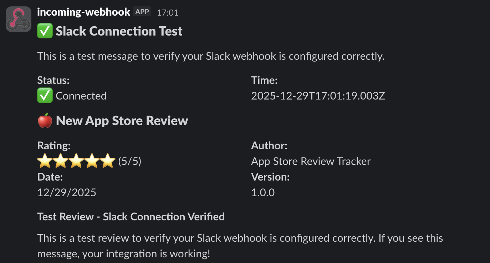

# App Store Review Tracker

Automated tracking and monitoring system for Apple App Store and Google Play Store reviews. Fetches reviews on a schedule, stores them in DynamoDB, and posts new reviews to Slack channels.

## Table of Contents

- [About](#about)
- [Tech Stack](#tech-stack)
- [Prerequisites](#prerequisites)
- [Setup](#setup)
- [Running locally](#running-locally)
- [Deployment](#deployment)
- [Configuration](#configuration)
- [API dependencies](#api-dependencies)
- [Markdown writing guide](#markdown-writing-guide)
- [Bug reports](#bug-reports)

## About

App Store Review Tracker is a serverless application that automatically monitors app reviews from both the Apple App Store and Google Play Store. It runs on a scheduled basis (configurable, default hourly), fetches new reviews, stores them in DynamoDB to track which reviews have already been processed, and posts new reviews to configured Slack channels via webhooks.

### Slack Notifications

Reviews are automatically posted to Slack channels with a formatted message showing the review details:



The system consists of:

- **Lambda Function**: Handles review fetching, storage, and Slack notifications
- **API Gateway**: Provides REST API endpoints for manual review checks and analytics
- **EventBridge**: Triggers scheduled review checks
- **DynamoDB**: Stores review data and tracks processed reviews
- **Web Dashboard**: Next.js application for viewing review analytics
- **Authorizer**: Lambda authorizer for API Gateway authentication

## Tech Stack

- [AWS Lambda](https://aws.amazon.com/lambda/) - Serverless compute for review processing
- [AWS API Gateway](https://aws.amazon.com/api-gateway/) - REST API endpoints
- [AWS EventBridge](https://aws.amazon.com/eventbridge/) - Scheduled event triggers
- [AWS DynamoDB](https://aws.amazon.com/dynamodb/) - Review data storage
- [Terraform](https://www.terraform.io/) - Infrastructure as Code
- [Next.js](https://nextjs.org/) - Web dashboard
- [TypeScript](https://www.typescriptlang.org/) - Type-safe development
- [Bun](https://bun.sh/) - Package manager and runtime
- [Node.js](https://nodejs.org/) - Runtime environment

## Prerequisites

Before you begin, ensure you have the following installed:

- [Bun](https://bun.sh/) version `1.2.21` or higher
- [Node.js](https://nodejs.org/) version `22` or higher
- [Terraform](https://www.terraform.io/downloads) version `1.0` or higher
- [AWS CLI](https://aws.amazon.com/cli/) configured with appropriate credentials
- An AWS account with permissions to create Lambda functions, API Gateway, EventBridge rules, DynamoDB tables, and related resources
- A Slack workspace with webhook URLs for posting reviews (optional but recommended)

## Setup

1. Clone the repository:

```bash
git clone https://github.com/luke-h1/app-store-review-tracker.git
cd app-store-review-tracker
```

2. Install dependencies:

```bash
bun install
```

3. Configure Terraform backend (optional but recommended):

Edit `terraform/remote.tf` to configure your S3 backend for Terraform state management.

4. Create environment-specific Terraform variables:

Copy `terraform/envs/example.tfvars` to create your own environment file (e.g., `terraform/envs/staging.tfvars`) and configure:

- `apple_app_ids`: List of Apple App Store app IDs to monitor
- `google_app_ids`: List of Google Play Store app IDs to monitor (currently not fully implemented)
- `app_slack_webhook_map`: Map of app IDs to Slack webhook URLs (keys: 'platform:appId', values: webhook URLs)
- `apple_country`: Country code for Apple App Store reviews (e.g., 'gb', 'us')
- `review_limit`: Maximum number of reviews to fetch per check
- `api_key`: API key for authorizer authentication
- `zone_id`: Route53 zone ID for custom domain (if using)
- Certificate details for custom domain (if using)

## Running locally

### Lambda Functions

The Lambda functions can be tested locally, but they require AWS credentials and access to DynamoDB. For local development:

1. Build the Lambda function:

```bash
cd apps/lambda
bun run build
```

2. Set up local environment variables matching the Lambda environment:

```bash
export REVIEWS_TABLE_NAME=your-table-name
export AWS_REGION=eu-west-2  # Automatically set by AWS Lambda in production
export APPLE_APP_IDS=your-app-id
export APP_SLACK_WEBHOOK_MAP='{"apple:your-app-id":"https://hooks.slack.com/services/..."}'
```

3. Use AWS SAM or similar tools to test Lambda functions locally, or deploy to a development environment.

### Web Dashboard

1. Navigate to the web app directory:

```bash
cd apps/web
```

2. Start the development server:

```bash
bun run dev
```

3. Open [http://localhost:3000](http://localhost:3000) in your browser.

The web dashboard connects to the deployed API Gateway endpoint. Ensure your API Gateway is deployed and accessible.

## Deployment

### Infrastructure Deployment

Deploy the infrastructure using Terraform:

1. Navigate to the terraform directory:

```bash
cd terraform
```

2. Initialize Terraform:

```bash
terraform init
```

3. Review the deployment plan:

```bash
terraform plan -var-file=envs/production.tfvars
```

4. Apply the infrastructure:

```bash
terraform apply -var-file=envs/production.tfvars
```

This will create:

- Lambda functions (main handler and authorizer)
- API Gateway with REST API endpoints
- EventBridge rules for scheduled review checks
- DynamoDB tables for review storage and Terraform state locking
- IAM roles and policies
- CloudWatch log groups

### Lambda Function Deployment

The Lambda function is automatically packaged and deployed by Terraform. To update the Lambda code:

1. Build the Lambda function:

```bash
cd apps/lambda
bun run build
```

2. Re-run Terraform apply:

```bash
cd terraform
terraform apply -var-file=envs/production.tfvars
```

Terraform will detect changes in the Lambda zip file and update the function.

### Web Dashboard Deployment

The web dashboard can be deployed to Vercel, AWS Amplify, or any Next.js-compatible hosting platform:

1. Build the web app:

```bash
cd apps/web
bun run build
```

2. Deploy using your preferred platform. For Vercel:

```bash
vercel deploy
```

Ensure the `NEXT_PUBLIC_API_URL` environment variable is set to your API Gateway endpoint URL.

## Configuration

### Environment Variables

The Lambda function uses the following environment variables (configured via Terraform):

| Variable                | Description                                       | Example                                                       |
| ----------------------- | ------------------------------------------------- | ------------------------------------------------------------- |
| `REVIEWS_TABLE_NAME`    | DynamoDB table name for storing reviews           | `appstore-review-tracker-production-reviews`                  |
| `APPLE_APP_IDS`         | Comma-separated list of Apple App Store app IDs   | `1345907668,6740410176`                                       |
| `GOOGLE_APP_IDS`        | Comma-separated list of Google Play Store app IDs | `com.example.app`                                             |
| `APP_SLACK_WEBHOOK_MAP` | JSON map of app IDs to Slack webhook URLs         | `{"apple:1345907668":"https://hooks.slack.com/services/..."}` |
| `COUNTRY`               | Country code for Apple App Store reviews          | `gb`                                                          |
| `REVIEW_LIMIT`          | Maximum number of reviews to fetch per check      | `10`                                                          |

### Scheduled Review Checks

Review checks run automatically via EventBridge on a schedule (default: hourly). The schedule can be modified in `terraform/eventbridge.tf`:

```hcl
schedule_expression = "rate(1 hour)"  # Change to desired schedule
```

### API Endpoints

The API Gateway exposes the following endpoints:

- `GET /reviews` - Manually trigger a review check
  - Query parameters:
    - `appleAppId` (optional): Apple App Store app ID
    - `googleAppId` (optional): Google Play Store app ID
    - `country` (optional): Country code (default: 'gb')
    - `limit` (optional): Number of reviews to fetch (default: 10)
    - `sortBy` (optional): 'mostRecent' or 'mostHelpful' (default: 'mostRecent')
- `GET /health` - Health check endpoint
- `GET /version` - Version information
- `GET /analytics` - Review analytics data

All endpoints require authentication via the authorizer (API key).

## API dependencies

The application depends on the following external APIs and services:

| Title                   | Description                                             | Base URL                                                  |
| ----------------------- | ------------------------------------------------------- | --------------------------------------------------------- |
| Apple App Store RSS     | Apple App Store customer reviews RSS feed               | `https://itunes.apple.com/{country}/rss/customerreviews/` |
| Google Play Console API | Google Play Store reviews API (requires authentication) | `https://androidpublisher.googleapis.com/`                |
| Slack Webhooks          | Slack incoming webhooks for posting reviews             | `https://hooks.slack.com/services/`                       |

> [!NOTE]
> Google Play Store reviews require authentication via the Google Play Console API. The implementation is currently a placeholder and needs to be completed with proper OAuth2 service account authentication.

## Markdown writing guide

This project uses GitHub Flavored Markdown. You can use callouts for notes, warnings, and tips:

> [!NOTE]
> This is a note

> [!WARNING]
> This is a warning

> [!IMPORTANT]
> This is important

> [!TIP]
> This is a tip

> [!CAUTION]
> This is a caution

## Bug reports

If you encounter a problem with this project, please open an issue. Be sure to include:

- Node version
- Bun version
- OS
- Brief but thorough reproduction steps of the issue (including screenshots/videos if applicable)
- Error messages or logs
- Environment (local, staging, production)
